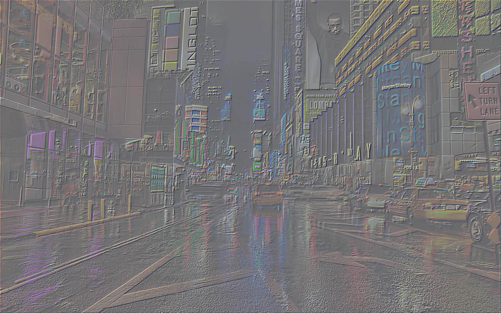
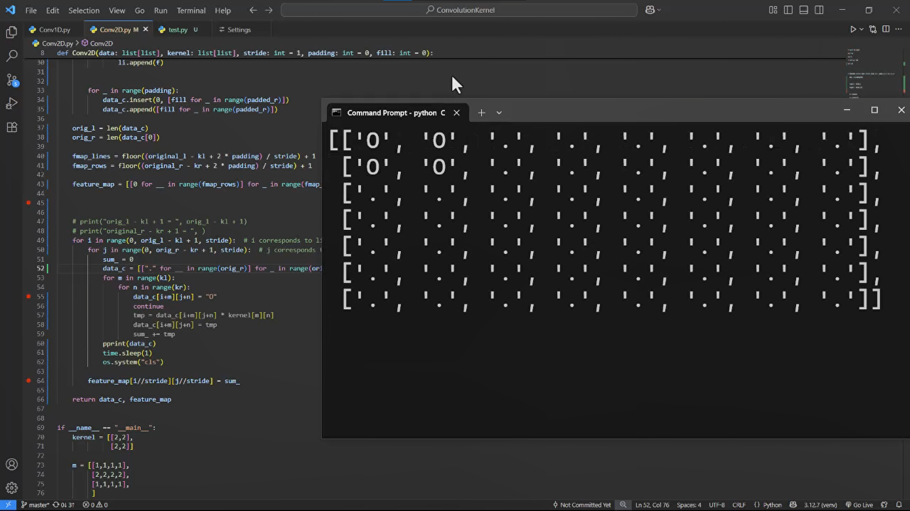
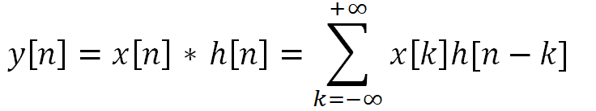

# Convolution Kernel

[](https://github.com/Ehsan-004/TinyUrler)
[](https://github.com/Ehsan-004/TinyUrler/blob/main/LICENSE)
[](https://github.com/Ehsan-004)
</br>

## A from-scratch implemention of Convolution operation on images and 1D, 2D arrays!
see kernels: [kernels](kernels.py)
</br>

emboss kernel effect:



</br>

a visual test to see how it works. you can uncomment line 54 in: [Conv2D.py](Conv2D.py)

[](images/vid.mp4)

## 📝 Description

This is a from-scratch implemention of 1D and 2D convolution.<br>


</br>

Read more about convolution on WikiPedia: [WikiPedia](https://www.google.com/url?sa=t&source=web&rct=j&opi=89978449&url=https://en.wikipedia.org/wiki/Convolution&ved=2ahUKEwjglMvhnJWOAxUDgP0HHUWPM1sQFnoECCYQAQ&usg=AOvVaw1cIbxRASR3i2RHCUrII3eD)


## ⚙️ Installation

To set up, follow the installation instructions:


1.  **Clone the repository:**

    ```bash
    git clone https://github.com/Ehsan-004/ConvolutionKernel
    cd ConvolutionKernel
    ```

2.  **Create a virtual environment:**

    ```bash
    python -m venv venv
    venv\Scripts\activate
    ```

3.  **Install dependencies:**

    ```bash
    pip install numpy
    ```
   
4.  **Run and manage test.py and main.py to see Convolved images:**
    ```bash
    python tset.py
    ```


## 🧑‍💻 Developer

- [Ehsan-004](https://github.com/Ehsan-004)

## 📜 License

This project is open-source and does not have a specific license. Feel free to use, modify, and distribute it as you see fit.